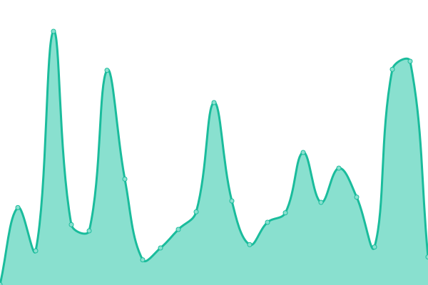

# [📈 Live Status](https://demo.upptime.js.org): <!--live status--> **🟧 Partial outage**

This repository contains the open-source uptime monitor and status page for [Soapbox](https://soapbox.pub/), powered by [Upptime](https://github.com/upptime/upptime).

With [Upptime](https://upptime.js.org), you can get your own unlimited and free uptime monitor and status page, powered entirely by a GitHub repository. We use [Issues](https://github.com/soapbox-pub/mostr-uptime/issues) as incident reports, [Actions](https://github.com/soapbox-pub/mostr-uptime/actions) as uptime monitors, and [Pages](https://demo.upptime.js.org) for the status page.

<!--start: status pages-->
<!-- This summary is generated by Upptime (https://github.com/upptime/upptime) -->
<!-- Do not edit this manually, your changes will be overwritten -->
<!-- prettier-ignore -->
| URL | Status | History | Response Time | Uptime |
| --- | ------ | ------- | ------------- | ------ |
|  [Mostr Bridge](https://mostr.pub/api/healthcheck) | 🟥 Down | [mostr-bridge.yml](https://github.com/soapbox-pub/mostr-uptime/commits/HEAD/history/mostr-bridge.yml) | 

 898ms
     
 | 

<a href="https://uptime.mostr.pub/history/mostr-bridge">99.93%</a>
    

|  [Mostr Relay](https://relay.mostr.pub/) | 🟩 Up | [mostr-relay.yml](https://github.com/soapbox-pub/mostr-uptime/commits/HEAD/history/mostr-relay.yml) | 

 928ms
     
 | 

<a href="https://uptime.mostr.pub/history/mostr-relay">99.12%</a>
    

<!--end: status pages-->

[**Visit our status website →**](https://demo.upptime.js.org)

## 📄 License

- Powered by: [Upptime](https://github.com/upptime/upptime)
- Code: [MIT](./LICENSE) © [Anand Chowdhary](https://anandchowdhary.com), supported by [Pabio](https://pabio.com)
- Data in the `./history` directory: [Open Database License](https://opendatacommons.org/licenses/odbl/1-0/)
